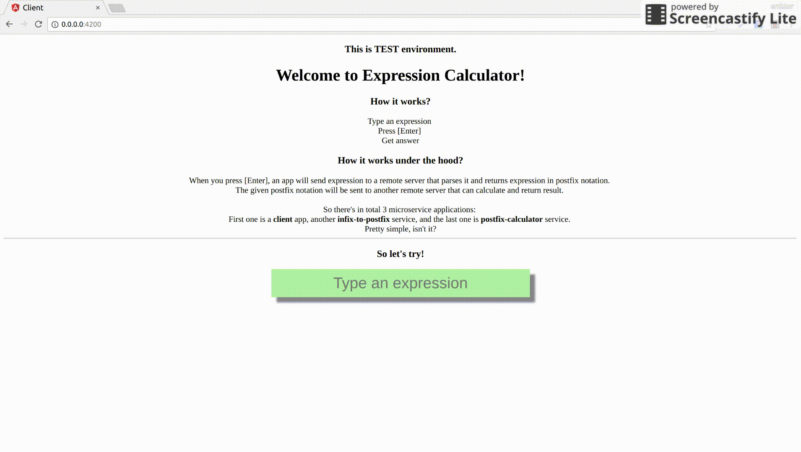

# Xcalculator

Simple expression calculator.

> Built for microservice architecture demo purposes.

> This project source can be used as a starter for microservice architectured applications, using **Docker**, **Angular** and **Koa\Typescript**

## Get started

_Simple expression calculator consists of 3 standalone applications_

* **Infix to postfix notation converter**
  * Responsible for converting [infix](https://en.wikipedia.org/wiki/Infix_notation) to [postfix notation](https://en.wikipedia.org/wiki/Reverse_Polish_notation) expression.
  * Built using **Koa** and **Typescript**
* **Postfix notation calculator**
  * Responsible for calculating postfix notation.
  * Built using **Koa** and **Typescript**
* **Client**
  * Frontend application.
  * Built using **Angular**

> All apps have their own `Dockerfile`s.
> Moreover, there exists `docker-compose.yml` file that describes overall application.

## Built With

* [Docker](https://www.docker.com/community-edition)
* [Angular](https://angular.io/docs)
* [Koa](https://github.com/koajs/koa)
* [Typescript](https://www.typescriptlang.org/docs/home.html)

## Examples

